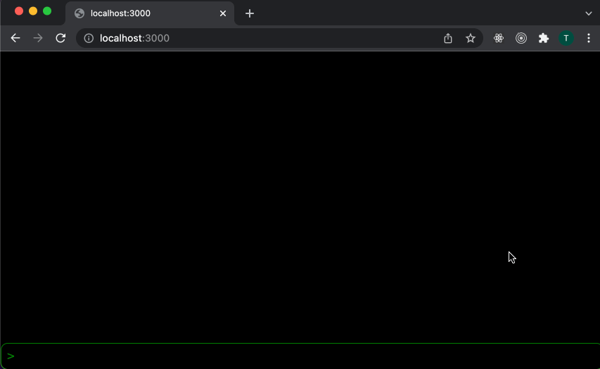

# Holistics - Ledis

The main idea behind the implementation is to use two dictionaries (one for timeout and one for key-value) to store the data. At first, the program used the switch statement to identify the commands and perform proper actions. However, as the number of commands grew up, I decided to use a hash map to store these commands. This reduces a significant amount of code. The most challenging requirement is saving and loading the old version. This feature was made using an additional dictionary.

## Notes

- This program can ignore lowercase/uppercase letters and spaces in commands. That said, it can understand invalid commands such as `SeT_____Hello__World` (`_` are spaces). However, lowercase/uppercase letters in keys/values are treated differently ("Hello" is different from "hello").
- The show timeout command (TTL) will display the remaining time that the key will be removed, not the origin timeout.
- For simplicity, the timeout is lost after restoring the data. It's not so hard to allow the users to store multiple versions and save the timeout. But I decided not to do so since I didn't have much time.
- This program will return undefined when users access to a key that doesn't exist.

## Features

Completed all the required/optional features (details below). Besides that, I also added some other features that may be useful.

### Additional Features

- [x] HELP: displaying help for all the commands.
- [x] HELP + COMMAND: displaying help for a specific command.
- [x] Auto-complete: complete the input when users click tab.

### Requirements

#### String

- [x] SET key value: set a string value, always overwriting what is saved under key.
- [x] GET key: get a string value at key.

#### Set

- [x] SADD key value1 [value2...]: add values to set stored at key.
- [x] SREM key value1 [value2...]: remove values from set.
- [x] SMEMBERS key: return array of all members of set.

#### Data Expiration

- [x] KEYS: List all available keys.
- [x] DEL key: delete a key.
- [x] EXPIRE key seconds: set a timeout on a key, seconds is a positive integer (by default a key has no expiration). Return the number of seconds if the timeout is set.
- [x] TTL key: query the timeout of a key.

#### Error Handling

- [x] Detect errors.

### Optional Features

- [x] Display detailed informations about errors.
- [x] SINTER [key1] [key2] [key3] ...: (bonus) set intersection among all set stored in specified keys. Return array of members of the result set.
- [x] SAVE: save current state in a snapshot.
- [x] RESTORE: restore from the last snapshot.

## Set up

- You need to have node.js and npm installed before being able to run this program.
- After cloning the project and directing to its directory, run ` $node app.js `. The program should then be available at http://localhost:3000/.

## Demo

